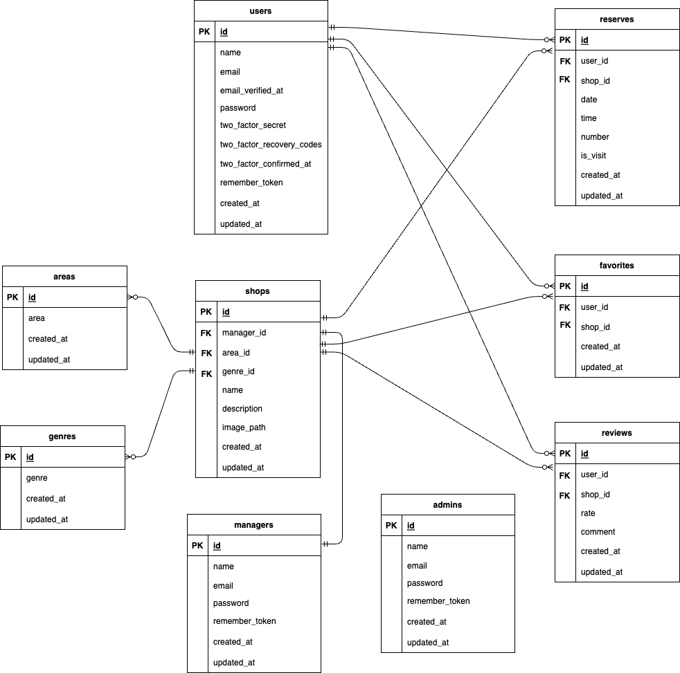

## アプリケーション名
Rese

## 作成した目的
飲食店予約アプリ
飲食店を紹介して、予約、レビュー、事前決済をする

## URL
- 開発環境：http://localhost/
- phpMyAdmin:：http://localhost:8080/
- 本番環境：http://atte.blog

## 機能一覧
- 飲食店一覧
- 飲食店詳細表示機能
- エリア検索機能
- ジャンル検索機能
- 店名検索機能
- レビュー表示機能
- 会員登録機能（一般ユーザーアカウント）
- ログイン機能
- ログアウト機能
- お気に入り追加機能
- お気に入り削除機能
- 予約機能
- 予約削除機能
- 予約変更機能
- 事前決済機能
- 来店済み確認機能
- 評価機能
- 店舗新規登録機能
- 店舗情報変更機能
- 店舗の予約確認機能
- 管理者による会員登録機能（管理者アカウント・店舗マネージャーアカウント・一般ユーザーアカウント）
- 全アカウントに対する一斉メール送信機能
- リマインダー機能

## 機能補足
##### ログイン機能
ログインは、admin・shopManager・userの3つの役割で行える
シーディング後下記4つのアカウントを使用できます

admin(管理者)  Email:k.takakura@poppoya.example Password:password
shopManager(店舗管理者) Email:kitaouji@kinkin.example Password:password
shopManager(店舗管理者) Email:ishiharapro@example Password:password
user(一般ユーザー) Email:sunnychiba@samurai.example Password:password

shopManagerアカウントを2つ用意しています
店舗新規登録機能の確認はkitaouji@kinkin.exampleアカウントで行なってください
店舗情報変更機能と店舗の予約確認機能の確認はishiharapro@exampleアカウントで行なってください
<br>

##### 来店済み確認機能
userアカウントでログイン後、ハンバーガーメニューよりMyPageを選択
MyPage画面左の予約状況のQRコードを読み取り、画面遷移する
来店確認画面が表示されるので、はいを選択すれば来店済みになります
来店済みにすると、MyPageの画面左に表示されていた予約が、画面右の来店済みの方に表示されます
<br>

##### 店舗新規登録機能
kitaouji@kinkin.exampleアカウントでログイン後、ハンバーガーメニューよりShopManagerを選択
<br>

##### 店舗情報変更機能
ishiharapro@exampleアカウントでログイン後、ハンバーガーメニューよりShopManagerを選択
<br>
#####  店舗の予約確認機能
ishiharapro@exampleアカウントでログイン後、ハンバーガーメニューよりShopReserveを選択
<br>

##### 管理者による会員登録機能
adminアカウントでログイン後、ハンバーガーメニューよりAdminRegisterを選択
Username Email Password は任意のものを記入
一番下の欄でAdmin・ShopManager・Userの3つの役割から選択できます
Userアカウントを作成した場合のみメール認証が必要です
Userアカウントでログイン後、MyPageに遷移するタイミング、もしくは店舗詳細より予約を行おうとするタイミングで認証画面に遷移します
認証メールの再送信をして、送信されたメールより認証を行なってください
<br>

##### 全アカウントに対する一斉メール送信機能
メール送信に時間がかかる場合があるので、送信が完了するまでしばしお待ちください

## 使用技術(実行環境)
- PHP8.3.3
- Laravel8.83.8
- MySQL8.3.0

## ER図


## 環境構築
**Dockerビルド**
1. `git clone git@github.com:cobaaan/rese2.git`
2. DockerDesktopアプリを立ち上げる
3. `docker-compose up -d --build`

> *MacのM1・M2チップのPCの場合、`no matching manifest for linux/arm64/v8 in the manifest list entries`のメッセージが表示されビルドができないことがあります。
エラーが発生する場合は、docker-compose.ymlファイルの「mysql」内に「platform」の項目を追加で記載してください*
``` bash
mysql:
    platform: linux/x86_64(この文追加)
    image: mysql:8.0.26
    environment:
```

**Laravel環境構築**
1. `docker-compose exec php bash`
2. `composer install`
3. 「.env.example」ファイルを 「.env」ファイルに命名を変更。または、新しく.envファイルを作成
4. .envに以下の環境変数を追加
``` text
DB_CONNECTION=mysql
DB_HOST=mysql
DB_PORT=3306
DB_DATABASE=laravel_db
DB_USERNAME=laravel_user
DB_PASSWORD=laravel_pass
```
MAIL関係の設定とSTRIPE関係の設定もお願いします

5. アプリケーションキーの作成
``` bash
php artisan key:generate
```

6. マイグレーションの実行
``` bash
php artisan migrate
```

7. シーディングの実行
``` bash
php artisan db:seed
```

8. シンボリックリンクの作成
``` bash
php artisan storage:link
```